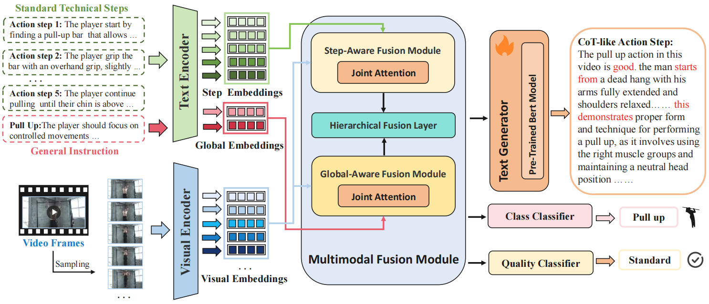
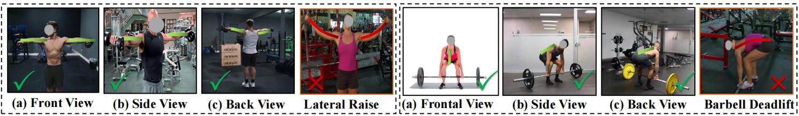
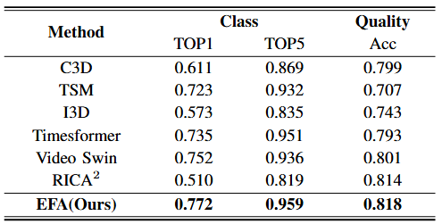
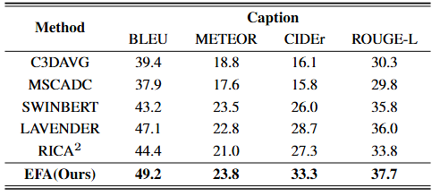
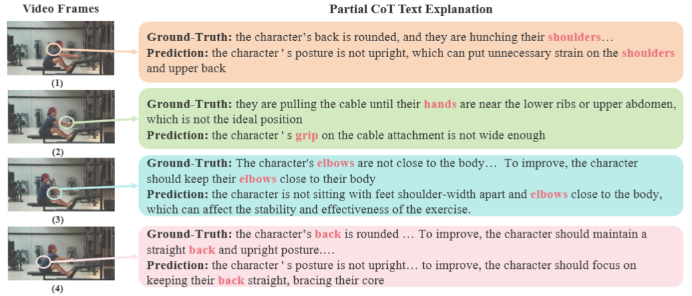

<div align="center" style="font-family: charter;">
<h1><i>Explainable Action Form Assessment</i>:</br> by Exploiting Multimodal Chain-of-Thoughts Reasoning</h1>

<br />
<a href="https://arxiv.org/abs/2512.15153" target="_blank">
    
</a>
<a href="https://github.com/MICLAB-BUPT/EFA" target="_blank">
    
</a>
<a href="https://www.kaggle.com/datasets/dd34dc6f49a960a31e03af896f85be526a72f8c9a684defd715c75d62bedbdc2" target="_blank">
    
</a>
<div>
<a href="https://jueduilingdu.github.io/" target="_blank">Mengshi Qi</a><sup>1</sup>,</span>
<a href="[INSERT_LINK_IF_AVAILABLE]" target="_blank">Yeteng Wu</a><sup>1</sup>, </span>
<a href="[INSERT_LINK_IF_AVAILABLE]" target="_blank">Wulian Yun</a><sup>1</sup>,</span>
<a href="[INSERT_LINK_IF_AVAILABLE]" target="_blank">Xianlin Zhang</a><sup>1</sup>,</span>
<a href="https://scholar.google.com/citations?user=A-vcjvUAAAAJ&hl=zh-CN" target="_blank">Huadong Ma</a><sup>1</sup></span>
</div>
<div>
    <sup>1</sup>State Key Laboratory of Networking and Switching Technology, Beijing University of Posts and Telecommunications, China </span>
</div>
 <!-- Assume this is Fig.1 from page1 -->
</div>

<p align="justify"><i>In real-world scenarios like fitness training and martial arts, evaluating if human actions conform to standard forms is essential for safety and effectiveness. Traditional video understanding focuses on what and where actions occur, but our work introduces the Action Form Assessment (AFA) task to assess how well actions are performed against objective standards. We present the CoT-AFA dataset, featuring diverse workout videos with Chain-of-Thought explanations that provide step-by-step reasoning, error analysis, and corrective solutions, enabling explainable feedback for skill improvement.</i></p>


## Release
- `2025-12-25` :rocket: Released the CoT-AFA dataset and EFA source code on GitHub.
- `2025-12-20` :hearts: Our paper is available on arXiv!
## CoT-AFA
**Overview:** We introduce CoT-AFA, a diverse dataset for the Human Action Form Assessment (AFA) task. It includes 3,392 videos (364,812 frames) of fitness and martial arts actions, with annotations for action categories, standardization (standard/non-standard), multiple viewpoints, and Chain-of-Thought text explanations. The dataset supports tasks like action classification, quality assessment, and explainable feedback generation.
 <!-- Assume this combines Fig.2 and Fig.3 from page3 -->

CoT-AFA features a three-level lexicon (workout mode, type, category) and multi-view annotations for comprehensive analysis.

| Dataset | Workout modes | Workout types | Action categories | Standard Videos | Non-standard Videos | Total Videos | Total Frames | CoT Text Explanations |
|---------|---------------|---------------|-------------------|-----------------|---------------------|--------------|--------------|-----------------------|
| CoT-AFA |       2       |      28       |        141        |      2,242      |        1,150        |    3,392     |    364,812   |         3,392         |

## Results
Our Explainable Fitness Assessor (EFA) framework achieves significant improvements:
- Explanation generation: +16.0% in CIDEr
- Action classification: +2.7% in accuracy
- Quality assessment: +2.1% in accuracy
<p align="center">
  
  
</p>

These results highlight the effectiveness of multimodal fusion and Chain-of-Thought reasoning in AFA.

## Run EFA
### Requirements

- Python 3.8
- PyTorch 2.4.1+cu124
- Transformers 4.46.3
- OpenCV 4.12.0.88
- Pandas 2.0.3
- NumPy 1.24.1
- Pillow 10.2.0
- scikit-learn 1.3.2
- DeepSpeed 0.17.6
- And other dependencies listed in `requirements.txt`

### Dataset Preparation
#### Dataset Download

The model is trained and evaluated on the GYM88 dataset, which contains fitness exercise videos with quality annotations.
1. **Download the CoT-AFA dataset**: The dataset can be obtained from https://www.kaggle.com/datasets/dd34dc6f49a960a31e03af896f85be526a72f8c9a684defd715c75d62bedbdc2. 

2. **Dataset Structure**: After downloading, organize the dataset as follows:
   ```
   AQA_data/
   ├── workout_ori/          # Original video files (.mp4)
   │   ├── 00/               # Exercise class 0 videos
   │   ├── 01/               # Exercise class 1 videos
   │   └── ...              # Other exercise classes
   └── frames/               # Extracted video frames (.jpg)
       ├── 00_00/     # Frames for video 1
       ├── 00_01/     # Frames for video 2
       └── ...
   ```
### Configuration

#### Modifying Dataset Paths

Edit the configuration file `_args/AFA.yaml` to update the dataset paths:

```yaml
dataset: {
    data_root: /path/to/AQA_data/workout_ori,  # Path to original videos
    video_dir: /path/to/AQA_data/frames,       # Path to extracted frames
    yaml_file: ./swinbert_val.yaml,
    train_datafile: train.pkl,                 # Path to train split pickle
    test_datafile: test.pkl,                   # Path to test split pickle
    max_seq_len: 256,
    input_frame_size: [398, 224],
    crop_frame_size: 224,
  }
```
### Training

To train the model:

```bash
CUDA_VISIBLE_DEVICES=0 python main_caption.py --config _args/args_AFA.json --path_output output
```

For multi-GPU training:
```bash
CUDA_VISIBLE_DEVICES=0,1 python -m torch.distributed.launch --nproc_per_node=2 --master_port=5567 main_caption.py --config _args/args_AFA.json --path_output output
```

### Evaluation

The model evaluates on COCO captioning metrics (BLEU, METEOR, ROUGE-L, CIDEr) and regression/classification metrics for quality assessment.

Evaluation results are saved in the `output/` directory with detailed metrics.
## Citation
If you find our paper, dataset, or code useful, please cite:
```
@misc{qi2025explainableactionformassessment,
      title={Explainable Action Form Assessment by Exploiting Multimodal Chain-of-Thoughts Reasoning}, 
      author={Mengshi Qi and Yeteng Wu and Xianlin Zhang and Huadong Ma},
      year={2025},
      eprint={2512.15153},
      archivePrefix={arXiv},
      primaryClass={cs.CV},
      url={https://arxiv.org/abs/2512.15153}, 
}
```


